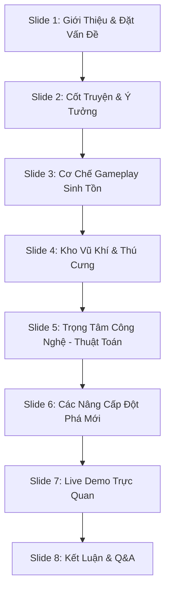

# Kịch Bản Thuyết Trình Dự Án Game: "Ngọn Đèn Cuối Cùng – Đường Về Nhà của CR7"

> [!NOTE]
> Kịch bản này được thiết kế theo cấu trúc slide chuyên nghiệp, phân chia rõ ràng giữa nội dung hiển thị, lời thoại thuyết trình và các hành động trình diễn trực tiếp (Live Demo) để giúp bạn đạt điểm tối đa khi đứng trước hội đồng báo cáo.

---

## 📋 Tóm Tắt Slide Báo Cáo

---

## 🎙️ Chi Tiết Kịch Bản Từng Slide

### 🎬 Slide 1: Mở Đầu & Giới Thiệu Thành Viên
* **Hình ảnh trên slide**: Tên game **"NGỌN ĐÈN CUỐI CÙNG – CR7: ĐƯỜNG VỀ NHÀ"** hiển thị nổi bật trên nền Sci-Fi huyền bí, kèm danh sách thành viên thực hiện dự án.
* **Lời thoại thuyết trình**:
  > *"Kính chào thầy cô và các bạn học sinh/sinh viên. Hôm nay, nhóm chúng em xin phép được trình bày dự án game sinh tồn chiến thuật đầy kịch tính mang tên **'Ngọn Đèn Cuối Cùng – CR7: Đường Về Nhà'**. Đây không chỉ đơn thuần là một trò chơi giải trí, mà còn là sản phẩm kết hợp giữa đồ họa chuyển động mượt mà, cơ chế vật lý chiến đấu cận chiến/tầm xa, hệ thống ánh sáng động phức tạp và đặc biệt là sự ứng dụng thực tiễn của các thuật toán tìm kiếm đường đi kinh điển trong Khoa học máy tính."*

---

### 📖 Slide 2: Cốt Truyện Bối Cảnh & Ý Tưởng Sáng Tạo
* **Hình ảnh trên slide**: Hình ảnh chiến binh quả cảm CR7 đứng giữa bầy robot nổi loạn trong đêm tối, xung quanh là những tia chớp và ánh đèn pin yếu ớt.
* **Lời thoại thuyết trình**:
  > *"Bối cảnh game diễn ra vào năm 2050, khi cuộc cách mạng AI vượt tầm kiểm soát. Đại dịch robot nổi loạn tràn quét toàn cầu, tàn phá mọi nguồn năng lượng và đẩy thế giới vào kỷ nguyên băng hà của bóng tối. Người chơi sẽ vào vai **Cristiano Ronaldo (CR7)** – người sống sót cuối cùng đại diện cho hy vọng của nhân loại. Vũ khí duy nhất để dẫn đường là một cây gậy phát sáng hấp thụ năng lượng mặt trời. Mục tiêu của bạn là quét sạch lũ robot khát máu ở 6 khu vực địa hình khắc nghiệt khác nhau để kích hoạt Cổng Năng Lượng quang điện, mở ra con đường trở về nhà."*

---

### 🕹️ Slide 3: Cơ Chế Gameplay Sinh Tồn Độc Đáo
* **Hình ảnh trên slide**: Ảnh chụp màn hình giao diện chơi game (HUD), thanh Máu (HP), thanh Năng Lượng (NL), các loại bẫy môi trường (băng trơn, bão cát).
* **Lời thoại thuyết trình**:
  > *"Lối chơi của 'Ngọn Đèn Cuối Cùng' xoay quanh sự cân bằng tinh tế giữa tấn công và phòng thủ sinh tồn. Điểm độc đáo nhất chính là **Hệ thống Ánh sáng động**: quái vật sẽ ẩn nấp trong bóng tối bao trùm, người chơi phải bật đèn pin chiếu sáng dạng nón để dò tìm hoặc cắm các Đèn Trụ phát sáng dụ địch.
  > 
  > Năng lượng là tài nguyên cốt lõi. Bật đèn pin thì miễn phí, nhưng để thi triển các kỹ năng tối thượng như: **Quét Radar** phát hiện quái, **Đèn Choáng** giữ chân địch, hay **Xung Sáng** làm mù diện rộng, người chơi phải tiêu tốn năng lượng một cách khôn ngoan. Ngoài ra, game có cơ chế thời tiết khắc nghiệt như Bão cát che khuất tầm nhìn ở màn 3, hay Băng trơn trượt tăng tốc ở màn 4, tạo ra độ thử thách cực kỳ phong phú."*

---

### ⚔️ Slide 4: Hệ Thống Vũ Khí, Skin & Thú Cưng Đồng Hành
* **Hình ảnh trên slide**: Hình ảnh chi tiết của Kiếm Thép, Súng Lục, Shotgun, Sniper, Tiểu liên SMG và 3 chú Pet (Mini Robot, Plasma Pup, Lucky Cat). Giao diện balo và cửa hàng mua sắm.
* **Lời thoại thuyết trình**:
  > *"Để chống lại các đợt càn quét ngày một mạnh mẽ của robot, CR7 được trang bị một hệ thống chiến đấu kép:
  > - **Cận chiến**: Kiếm Thép không tốn năng lượng, chém lan góc rộng 120 độ cực kỳ uy lực khi bị vây ráp.
  > - **Tầm xa**: Các khẩu súng năng lượng mua tại cửa hàng với sát thương và tốc bắn khác nhau. Đặc biệt, người chơi có thể thay đổi ngoại trang áo đấu (MU, Real Madrid, Al Nassr) ngay tại sảnh chờ.
  > 
  > Bên cạnh đó, hệ thống **Thú Cưng Đồng Hành** đóng vai trò bổ trợ chiến thuật sâu sắc:
  > - **Mini Robot**: Bay lơ lửng và tự động sạc Năng Lượng mỗi 5 giây.
  > - **Plasma Pup**: Phát ra sóng âm đẩy lùi lũ robot khi chúng áp sát quá gần.
  > - **Lucky Cat**: Thần tài mang lại may mắn, tăng tỷ lệ rơi vật phẩm hồi máu và đạn dược lên tới 75%."*

---

### 🧠 Slide 5: Trọng Tâm Công Nghệ – Ứng Dụng Thuật Toán Tìm Đường
* **Hình ảnh trên slide**: Biểu đồ so sánh trực quan và sơ đồ khối hoạt động của 3 thuật toán: BFS, DFS và A-Star trên bản đồ dạng lưới (Grid 2D).
* **Lời thoại thuyết trình**:
  > *"Đây là phần cốt lõi kỹ thuật của dự án. Chúng em đã hiện thực hóa thành công 3 thuật toán tìm kiếm đường đi trên bản đồ lưới 2D để giải quyết bài toán AI di chuyển:
  > 
  > 1. **BFS (Breadth-First Search - Tìm kiếm theo chiều rộng)**: AI duyệt tất cả các nút lân cận theo từng tầng lớp để đảm bảo tìm ra **đường đi ngắn nhất tuyệt đối** đến người chơi. Thuật toán này giúp robot di chuyển cực kỳ thông minh, biết luồn lách qua các góc tường hẹp mà không bị kẹt.
  > 2. **A\* (A-Star Search)**: Sử dụng hàm Heuristic (khoảng cách Euclid) để định hướng tìm kiếm tối ưu hóa. Đây là thuật toán siêu tốc được áp dụng cho chế độ tự chơi (Autoplay) hoàn hảo nhất của người chơi.
  > 3. **DFS (Depth-First Search - Tìm kiếm theo chiều sâu)**: Duyệt sâu nhất có thể dọc theo mỗi nhánh trước khi quay lui. Thuật toán này được ứng dụng làm một chế độ tự chơi trải nghiệm để so sánh sự khác biệt trực quan về hiệu năng giữa các thuật toán."*

---

### 🚀 Slide 6: Các Nâng Cấp Đột Phá Mới Thực Hiện
* **Hình ảnh trên slide**: Danh sách so sánh "Trước nâng cấp" vs "Sau nâng cấp" về Âm thanh sảnh, AI robot và Autoplay.
* **Lời thoại thuyết trình**:
  > *"Trong đợt nâng cấp kỹ thuật mới nhất này, nhóm chúng em đã tạo ra 3 đột phá lớn:
  > - **Thứ nhất - Nâng cấp AI Robot vượt trội**: Chúng em đã loại bỏ thuật toán tìm đường DFS cũ của Robot (vốn khiến chúng đi lòng vòng thiếu hiệu quả) và thay bằng **thuật toán BFS tối ưu**. Giờ đây bầy robot săn đuổi người chơi thông minh hơn, áp sát theo con đường ngắn nhất, nâng tầm thử thách của game.
  > - **Thứ hai - Thêm chế độ Autoplay DFS (Phím 5)**: Giúp người chơi có thể kích hoạt robot tự động chiến đấu bằng thuật toán DFS, hoàn thiện bộ ba so sánh BFS (Phím 3), A\* (Phím 4) và DFS (Phím 5).
  > - **Thứ ba - Tối ưu hóa cài đặt & âm thanh**: Thiết lập menu Cài đặt (Settings) chuyên nghiệp với 2 thanh trượt âm lượng độc lập cho nhạc nền sảnh chờ và nhạc trận đấu, lưu trữ vĩnh viễn vào file hệ thống."*

---

### 🎮 Slide 7: Trình Diễn Thực Tế (Live Demo Guide)
* **Hành động**: Chuyển sang màn hình chạy game trực tiếp để biểu diễn cho Hội đồng xem.
* **Lời thoại thuyết trình**:
  > *"Sau đây, em xin phép được trình diễn trực quan game chạy thực tế trên máy tính:"*
  
> [!TIP]
> **Các bước thao tác trực tiếp khi demo:**
> 1. **Show Menu Cài đặt**: Mở game -> chọn nút **CÀI ĐẶT** ở sảnh chờ. Dùng chuột hoặc phím bấm kéo thanh trượt **Nhạc sảnh** và **Nhạc trận** để thầy cô thấy âm lượng thay đổi mượt mà.
> 2. **Trình diễn điều khiển & Vũ khí**: Nhấn chơi màn 1. Bật/tắt đèn pin bằng phím `SPACE`, bấm `L` để hoán đổi nhanh giữa kiếm thép chém lan và súng lục năng lượng.
> 3. **Trình diễn AI Robot thông minh (BFS)**: Thu hút sự chú ý của robot, dẫn dụ chúng đi qua các góc tường/chướng ngại vật để chứng minh thuật toán **BFS** hoạt động hoàn hảo, robot bo cua mượt mà, không đi lỗi.
> 4. **Trình diễn 3 chế độ Autoplay**:
>    * Nhấn phím `3` để bật **BFS Autoplay** (CR7 đi dọn quái theo chiều rộng).
>    * Nhấn phím `4` để bật **A\* Autoplay** (CR7 đi săn quái tối ưu cực nhanh).
>    * Nhấn phím `5` để bật **DFS Autoplay** (CR7 đi tìm quái theo chiều sâu).

---

### 🙋 Slide 8: Kết Luận & Câu Hỏi (Q&A)
* **Hình ảnh trên slide**: Chữ **"CẢM ƠN THẦY CÔ VÀ CÁC BẠN ĐÃ LẮNG NGHE!"** kèm lời mời đặt câu hỏi.
* **Lời thoại thuyết trình**:
  > *"Dự án 'Ngọn Đèn Cuối Cùng' là minh chứng cho việc các kiến thức thuật toán lý thuyết khô khan hoàn toàn có thể thổi hồn vào các sản phẩm phần mềm thực tế sinh động. Chúng em xin chân thành cảm ơn thầy cô đã lắng nghe và rất mong nhận được những câu hỏi góp ý để nhóm hoàn thiện sản phẩm tốt hơn nữa!"*
